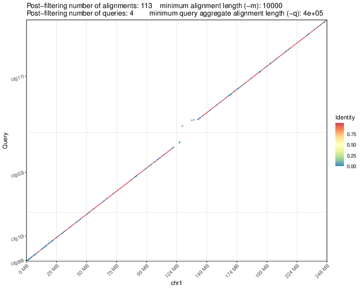
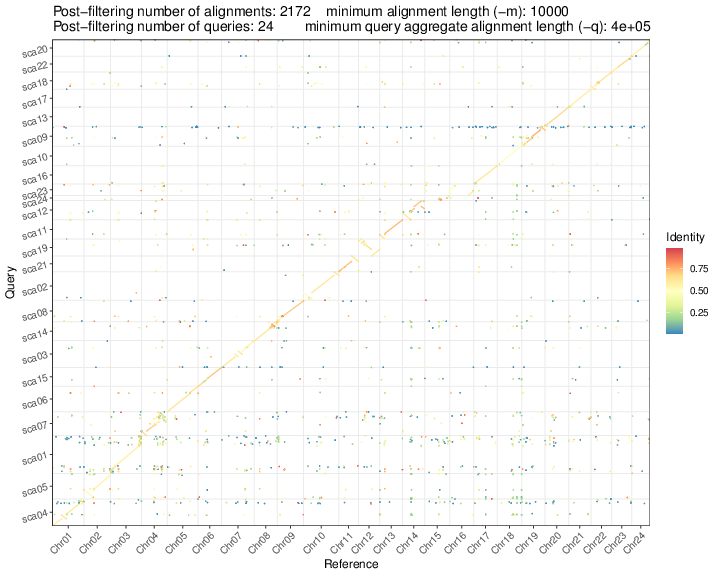

# Paf2dotplot
Draw a dot plot from a paf alignment (usually generated by [minimap2](https://github.com/lh3/minimap2)). Paf2dotplot is adapted from [dotPlotly](https://github.com/tpoorten/dotPlotly/), but it has some extra features and parameters, for details, just have a try!

## Dependencies  
The script requires two R packages: `optparse`, `ggplot2`

## Installation  
```sh
# download
git clone https://github.com/moold/paf2dotplot.git
# install R packages
R --slave -e 'install.packages(c("optparse", "ggplot2", "RColorBrewer"))'
```

## Usage
```sh
# do asm-to-ref mapping
minimap2 -cx asm10 asm1.fa asm2.fa > aln.paf
# draw
./paf2dotplot.r -f -b aln.paf
```
This will generate a result file `aln.paf.pdf` in the current directory. You can use [ImageMagick](https://github.com/ImageMagick/ImageMagick) command to do some format conversion or modification.
Here are two example images generated by Paf2dotplot:  
 

## Parameters
Use `./paf2dotplot.r -h` to see options.

## Update Notes

* Version 1.0.1 (2025.09.18):
  - Fixed `generate_colors()` when n < 3 (ensures correct length), #5 (Thanks to @dukecomeback).

* Version 1.0.0 (2025.08.19):
  - Added `-e, --ref-bed`: support reference BED file (vertical dotted lines).
  - Added `-E, --query-bed`: support query BED file (horizontal dotted lines).
  - Added `-v, --version`: show script version and exit.


	
